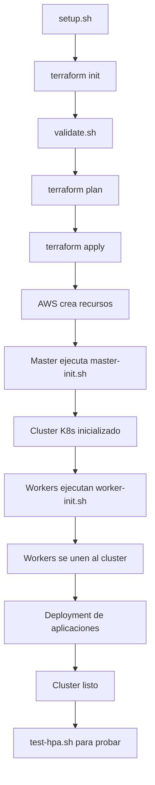

# 📦 Estructura del Proyecto

```
opentofu_scaler/
│
├── 📄 main.tf                      # Configuración principal de Terraform
│   ├── VPC y networking
│   ├── Security Groups
│   ├── S3 bucket para tokens
│   ├── IAM roles
│   ├── Instancia EC2 Master
│   ├── Instancias EC2 Workers
│   └── Null resource para deployment
│
├── 📄 variables.tf                 # Definición de variables
│   ├── aws_region
│   ├── ami_id
│   ├── instance_types
│   ├── worker_count
│   └── ssh_keys
│
├── 📄 outputs.tf                   # Outputs del deployment
│   ├── IPs públicas/privadas
│   ├── Comandos SSH
│   └── URL de la aplicación
│
├── 📄 terraform.tfvars.example     # Ejemplo de configuración
│   └── Plantilla para copiar
│
├── 📁 scripts/                     # Scripts de inicialización
│   ├── master-init.sh             # Configura el nodo master
│   │   ├── Instala containerd
│   │   ├── Instala kubeadm/kubelet/kubectl
│   │   ├── Inicializa cluster (kubeadm init)
│   │   ├── Instala Flannel CNI
│   │   ├── Instala Metrics Server
│   │   └── Sube token a S3
│   │
│   └── worker-init.sh             # Configura los nodos worker
│       ├── Instala containerd
│       ├── Instala kubeadm/kubelet/kubectl
│       ├── Descarga token de S3
│       └── Join al cluster
│
├── 📁 manifests/                   # Manifiestos de Kubernetes
│   └── hpa.yaml                   # HorizontalPodAutoscaler
│
├── 🔧 setup.sh                     # Script de configuración inicial
│   ├── Verifica dependencias
│   ├── Genera llaves SSH
│   ├── Crea terraform.tfvars
│   └── Inicializa Terraform
│
├── ✅ validate.sh                  # Script de validación
│   └── Verifica configuración antes de apply
│
├── 📊 test-hpa.sh                  # Script para probar HPA
│   ├── Genera carga
│   └── Monitorea escalado
│
├── 📖 README.md                    # Documentación completa
├── 🚀 QUICKSTART.md                # Guía rápida
├── 🔧 TROUBLESHOOTING.md           # Solución de problemas
└── 🙈 .gitignore                   # Archivos ignorados por Git

```

## 🔄 Flujo de Trabajo



## ⚙️ Proceso de Despliegue Detallado

### 1. Infraestructura AWS (Terraform)
```
terraform apply
    ↓
Crea VPC + Subnet + IGW
    ↓
Crea Security Group
    ↓
Crea S3 Bucket
    ↓
Crea IAM Roles
    ↓
Lanza EC2 Master
    ↓
Lanza EC2 Workers
```

### 2. Inicialización Master (user_data)
```
master-init.sh
    ↓
Actualiza sistema
    ↓
Instala AWS CLI
    ↓
Configura kernel (br_netfilter, etc)
    ↓
Instala containerd
    ↓
Instala kubeadm/kubelet/kubectl
    ↓
kubeadm init --pod-network-cidr=10.244.0.0/16
    ↓
Configura kubectl
    ↓
Instala Flannel CNI
    ↓
Instala Metrics Server
    ↓
Genera token de join
    ↓
Sube token a S3
    ↓
✓ Master listo
```

### 3. Inicialización Workers (user_data)
```
worker-init.sh
    ↓
Actualiza sistema
    ↓
Instala AWS CLI
    ↓
Configura kernel
    ↓
Instala containerd
    ↓
Instala kubeadm/kubelet/kubectl
    ↓
Espera master disponible
    ↓
Descarga token de S3
    ↓
Ejecuta comando de join
    ↓
✓ Worker unido al cluster
```

### 4. Despliegue de Aplicaciones (null_resource)
```
Terraform provisioner
    ↓
Copia manifiestos al master
    ↓
kubectl apply -f postgres.yaml
    ↓
kubectl apply -f web.yaml (incluye init_data.py)
    ↓
kubectl apply -f hpa.yaml
    ↓
✓ Aplicaciones desplegadas
```

## 📊 Componentes por Capa

### Capa AWS (IaaS)
- ✅ VPC (10.0.0.0/16)
- ✅ Subnet pública (10.0.1.0/24)
- ✅ Internet Gateway
- ✅ Route Table
- ✅ Security Group (puertos 22, 6443, 30000-32767, 80, 443)
- ✅ EC2 Master (t3.medium)
- ✅ EC2 Workers x2 (t3.small)
- ✅ S3 Bucket (join tokens)
- ✅ IAM Role + Policy

### Capa Kubernetes (CaaS)
- ✅ Control Plane (Master)
  - kube-apiserver
  - kube-controller-manager
  - kube-scheduler
  - etcd
- ✅ Worker Nodes
  - kubelet
  - kube-proxy
- ✅ Flannel CNI (10.244.0.0/16)
- ✅ Metrics Server

### Capa Aplicación (PaaS)
- ✅ PostgreSQL Deployment
- ✅ PostgreSQL Service (ClusterIP)
- ✅ Web Deployment (musiccloud)
- ✅ Web Service (NodePort:30080)
- ✅ DB Init Job
- ✅ HorizontalPodAutoscaler

## 🎯 Puntos Clave de la Implementación

### 1. **Automatización Completa**
Todo el proceso está automatizado desde la creación de la VPC hasta el deployment de aplicaciones.

### 2. **Join Automático de Workers**
Los workers se unen automáticamente al cluster usando tokens compartidos via S3.

### 3. **CNI Compatible**
Flannel se instala con el CIDR correcto (10.244.0.0/16) configurado en `kubeadm init`.

### 4. **Metrics Server Funcional**
Se aplica un patch para que funcione con certificados autofirmados (`--kubelet-insecure-tls`).

### 5. **HPA Listo**
El Horizontal Pod Autoscaler está configurado y listo para escalar la aplicación.

### 6. **Seguridad**
- IAM roles con permisos mínimos necesarios
- Security groups con reglas específicas
- S3 bucket para tokens efímeros

## 🛠️ Archivos de Configuración

### terraform.tfvars (generado por setup.sh)
```hcl
aws_region            = "us-east-1"
ami_id                = "ami-0866a3c8686eaeeba"
master_instance_type  = "t3.medium"
worker_instance_type  = "t3.small"
worker_count          = 2
ssh_public_key        = "ssh-rsa AAAA..."
ssh_private_key_path  = "~/.ssh/k8s-cluster-key"
```

### manifests/hpa.yaml
```yaml
apiVersion: autoscaling/v2
kind: HorizontalPodAutoscaler
metadata:
  name: web-hpa
spec:
  scaleTargetRef:
    apiVersion: apps/v1
    kind: Deployment
    name: web
  minReplicas: 1
  maxReplicas: 5
  metrics:
  - type: Resource
    resource:
      name: cpu
      target:
        type: Utilization
        averageUtilization: 50
```

## 📝 Comandos Útiles

```bash
# Configuración inicial
./setup.sh

# Validar configuración
./validate.sh

# Planificar deployment
terraform plan

# Desplegar cluster
terraform apply

# Ver outputs
terraform output

# Destruir cluster
terraform destroy

# Conectar al master
ssh -i ~/.ssh/k8s-cluster-key ubuntu@$(terraform output -raw k8s_master_public_ip)

# Verificar cluster (desde el master)
kubectl get nodes
kubectl get pods -A
kubectl get hpa

# Probar HPA (desde el master)
./test-hpa.sh
```

## 🔐 Seguridad y Mejores Prácticas

### Implementado ✅
- [x] Security Groups con reglas específicas
- [x] IAM roles con least privilege
- [x] Llaves SSH para acceso
- [x] S3 bucket privado
- [x] Destroy forzado del bucket

### Recomendaciones para Producción 🎯
- [ ] Restringir SSH solo a IPs conocidas
- [ ] Usar VPN o bastion host
- [ ] Configurar TLS para Kubernetes
- [ ] Usar secrets manager para credenciales
- [ ] Implementar network policies
- [ ] Configurar backups de etcd
- [ ] Usar EKS en lugar de self-managed

---

**Creado por:** Santiago  
**Proyecto:** Music Cloud - Kubernetes en AWS con IaC  
**Fecha:** Noviembre 2025
